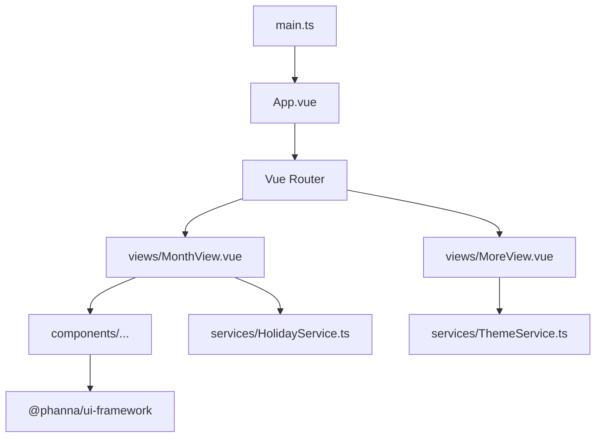

# Development Guide / មគ្គុទ្ទេសក៍អភិវឌ្ឍន៍

Welcome to the **Khmer Smart Calendar** development guide. This document outlines everything you need to know to start building, running, and modifying the application locally.  
សូមស្វាគមន៍មកកាន់មគ្គុទ្ទេសក៍អភិវឌ្ឍន៍ **ប្រតិទិនឆ្លាតវៃខ្មែរ**។ ឯកសារនេះបង្ហាញពីអ្វីគ្រប់យ៉ាងដែលអ្នកត្រូវដឹងដើម្បីចាប់ផ្តើមសរសេរកូដ ដំណើរការ និងកែប្រែកម្មវិធីនេះនៅលើកុំព្យូទ័ររបស់អ្នក។

## 🚀 Environment Setup / ការរៀបចំបរិស្ថាន

### Prerequisites / តម្រូវការជាមុន
- **Node.js**: v20 or higher is required. (តម្រូវឲ្យមាន v20 ឬខ្ពស់ជាងនេះ)
- **npm**: v9 or higher. (v9 ឬខ្ពស់ជាងនេះ)
- **IDE**: We recommend **VS Code** with the **Vue - Official (Volar)** extension. (យើងសូមណែនាំឲ្យប្រើ **VS Code** ជាមួយកម្មវិធីជំនួយ **Vue - Official (Volar)**)

### Installation / ការដំឡើង
Clone the repository and install the dependencies:  
ក្លូន (Clone) ឃ្លាំងផ្ទុកទិន្នន័យ (Repository) នេះ ហើយដំឡើងកញ្ចប់ឯកសារ (dependencies):
```bash
git clone https://github.com/pangphannarupp/vue-base-project.git
cd vue-base-project
npm install
```

*(Note: The project uses a local tarball `@phanna/ui-framework`. If you ever face dependency issues with UI components, run `npm install ./phanna-ui-framework-1.0.5.tgz` to force a re-installation.)*  
*(ចំណាំ៖ គម្រោងនេះប្រើប្រាស់ឯកសារក្រៅបណ្តាញ (Local tarball) `@phanna/ui-framework`។ ប្រសិនបើអ្នកជួបបញ្ហាទាក់ទងនឹង UI components សូមដំណើរការ `npm install ./phanna-ui-framework-1.0.5.tgz` ដើម្បីបង្ខំឲ្យដំឡើងវាឡើងវិញ។)*

## 💻 Local Development / ការអភិវឌ្ឍន៍តាមម៉ាស៊ីន (Local)

To start the Vite development server with Hot Module Replacement (HMR):  
ដើម្បីចាប់ផ្តើមម៉ាស៊ីនបម្រើ (Server) អភិវឌ្ឍន៍ Vite ជាមួយនឹង Hot Module Replacement (HMR):
```bash
npm run dev
```
Open your browser to `http://localhost:5173`. Any changes you make to Vue files or CSS will instantly reflect in the browser.  
បើកកម្មវិធីរុករករបស់អ្នក (Browser) ទៅកាន់ `http://localhost:5173`។ រាល់ការផ្លាស់ប្តូរដែលអ្នកធ្វើចំពោះឯកសារ Vue ឬ CSS នឹងមានប្រសិទ្ធភាពភ្លាមៗនៅក្នុងកម្មវិធីរុករក។

## 🏗 Architecture & Best Practices / ស្ថាបត្យកម្ម និងការអនុវត្តល្អបំផុត

This project uses **Vue 3 Composition API** with `<script setup>` syntax and **TypeScript**.  
គម្រោងនេះប្រើប្រាស់ **Vue 3 Composition API** ជាមួយវាក្យសម្ព័ន្ធ `<script setup>` និង **TypeScript**។



### Key Directories / ថតសំខាន់ៗ
- **`src/views/`**: Page-level components (e.g., `MonthView.vue`, `DayView.vue`). Each view maps directly to a Vue Router path. (សមាសភាគកម្រិតទំព័រ ដែលទំព័រនីមួយៗត្រូវគ្នាដោយផ្ទាល់ទៅនឹងតំណភ្ជាប់ Vue Router)
- **`src/components/`**: Reusable UI components. Try to keep these as "dumb" (stateless) as possible, relying on props and emitted events. (សមាសភាគ UI ដែលអាចប្រើឡើងវិញបាន។ សូមព្យាយាមរក្សាវាឲ្យសាមញ្ញបំផុតដោយពឹងផ្អែកលើ props និង events)
- **`src/services/`**: Centralized state and logic. We use standalone exported reactive states (e.g., `HolidayService.ts`, `ThemeService.ts`) instead of a heavy library like Pinia. (កន្លែងផ្ទុកទិន្នន័យ (State) និងតក្កវិជ្ជាកណ្តាល ដោយមិនប្រើប្រាស់ Pinia ដើម្បីរក្សាកម្មវិធីឲ្យស្រាល)

### MVVM Architecture / ស្ថាបត្យកម្ម MVVM
Vue 3 implements the **Model-View-ViewModel (MVVM)** pattern:  
Vue 3 អនុវត្តទម្រង់ **Model-View-ViewModel (MVVM)**៖
- **Model (ទិន្នន័យ)**: The raw state and business logic, handled by our `services/` (e.g., `ThemeService.ts`). (ទិន្នន័យឆៅ និងតក្កវិជ្ជាអាជីវកម្ម ដែលគ្រប់គ្រងដោយ `services/`)
- **View (ចំណុចប្រទាក់)**: The HTML `<template>` section of our components that displays the UI. (ផ្នែក HTML `<template>` នៃសមាសភាគរបស់យើងដែលបង្ហាញ UI)
- **ViewModel (អ្នកសម្របសម្រួល)**: The `<script setup>` block that binds the Model to the View reactively using `ref` and `computed`. (ផ្នែក `<script setup>` ដែលភ្ជាប់ Model ទៅនឹង View ដោយស្វ័យប្រវត្តិ តាមរយៈការប្រើប្រាស់ `ref` និង `computed`)

### Stateless vs Stateful Components / សមាសភាគមានរដ្ឋ (Stateful) និងគ្មានរដ្ឋ (Stateless)
To keep the application maintainable, we heavily split components into two types:  
ដើម្បីរក្សាកម្មវិធីឲ្យងាយស្រួលថែទាំ យើងបំបែកសមាសភាគជាពីរប្រភេទធំៗ៖

1. **Stateless (Dumb) Components / សមាសភាគគ្មានរដ្ឋ**: 
   - They do not manage their own internal data state. (ពួកវាមិនគ្រប់គ្រងទិន្នន័យផ្ទាល់ខ្លួនទេ)
   - They receive data via `props` and communicate user actions via `emits`. (ពួកវាទទួលទិន្នន័យតាមរយៈ `props` និងបញ្ជូនសកម្មភាពអ្នកប្រើប្រាស់តាមរយៈ `emits`)
   - *Example*: A custom Button or `EventItem.vue`. (ឧទាហរណ៍៖ ប៊ូតុង ឬ `EventItem.vue`)
2. **Stateful (Smart) Components / សមាសភាគមានរដ្ឋ**: 
   - They fetch data from Services or APIs and manage complex logic. (ពួកវាទាញយកទិន្នន័យពីសេវាកម្ម (Services) ឬ APIs និងគ្រប់គ្រងតក្កវិជ្ជាស្មុគស្មាញ)
   - They pass data down to Stateless components. (ពួកវាបញ្ជូនទិន្នន័យចុះក្រោមទៅឲ្យសមាសភាគគ្មានរដ្ឋ)
   - *Example*: `MonthView.vue` fetching holidays and passing them down to the calendar component. (ឧទាហរណ៍៖ `MonthView.vue` ទាញយកថ្ងៃឈប់សម្រាក ហើយបញ្ជូនវាទៅកាន់ប្រតិទិន)

**Why is this clear and maintainable? / ហេតុអ្វីបានជារចនាសម្ព័ន្ធនេះច្បាស់លាស់ និងងាយស្រួលថែទាំ?**
- **Reusability (ការប្រើប្រាស់ឡើងវិញ)**: Stateless components like `EventItem.vue` can be reused anywhere because they don't depend on a specific API or Service. They just need data passed to them. (សមាសភាគគ្មានរដ្ឋដូចជា `EventItem.vue` អាចប្រើឡើងវិញនៅទីណាក៏បាន ព្រោះវាមិនពឹងផ្អែកលើ API ឬ Service ណាមួយឡើយ វាគ្រាន់តែត្រូវការទិន្នន័យដែលគេបញ្ជូនមកឲ្យប៉ុណ្ណោះ។)
- **Testability (ភាពងាយស្រួលក្នុងការសាកល្បង)**: It is extremely easy to write Unit tests for a stateless component—just pass fake `props` and check if it renders correctly! (វាងាយស្រួលណាស់ក្នុងការសាកល្បងសមាសភាគគ្មានរដ្ឋ ដោយគ្រាន់តែបញ្ជូន `props` ក្លែងក្លាយ ហើយពិនិត្យមើលថាតើវាបង្ហាញត្រឹមត្រូវឬអត់!)
- **Separation of Concerns (ការបែងចែកទំនួលខុសត្រូវ)**: If there is a bug in the data, you only fix the Stateful component or Service. If there is a UI bug, you only fix the Stateless component. (ប្រសិនបើមានកំហុសទិន្នន័យ អ្នកគ្រាន់តែជួសជុលសមាសភាគមានរដ្ឋ ឬសេវាកម្ម។ ប្រសិនបើមានកំហុសចំណុចប្រទាក់ (UI) អ្នកគ្រាន់តែជួសជុលសមាសភាគគ្មានរដ្ឋ។)

**Real-world Example (ឧទាហរណ៍ជាក់ស្តែង):**
Let's look at the **Events Screen** (`EventsView.vue`):  
សូមមើល **អេក្រង់ព្រឹត្តិការណ៍** (`EventsView.vue`)៖

1. **`EventsView.vue` (Stateful / មានរដ្ឋ)**: It imports `HolidayService`, fetches the list of upcoming holidays, and holds that list in a `ref`. (វានាំចូល `HolidayService` ទាញយកបញ្ជីថ្ងៃឈប់សម្រាក ហើយរក្សាទុកវានៅក្នុង `ref`។)
2. **`EventItem.vue` (Stateless / គ្មានរដ្ឋ)**: It receives a single `holiday` object as a `prop` and just renders the Title, Date, and Icon. It does not know *where* the holiday came from. (វាទទួលបានទិន្នន័យ `holiday` មួយតាមរយៈ `prop` ហើយគ្រាន់តែបង្ហាញចំណងជើង កាលបរិច្ឆេទ និងរូបតំណាង។ វាមិនដឹងថាថ្ងៃឈប់សម្រាកនោះមកពីណាទេ ដែលធ្វើឲ្យវាងាយស្រួលប្រើប្រាស់ឡើងវិញបំផុត។)

### Coding Guidelines / គោលការណ៍ណែនាំក្នុងការសរសេរកូដ
1. **TypeScript First / ផ្តោតលើ TypeScript ជាចម្បង**: Always type your props, emits, and variables. Avoid `any`. (តែងតែកំណត់ប្រភេទ (Type) សម្រាប់ props, emits និងអថេររបស់អ្នក។ ជៀសវាងការប្រើប្រាស់ `any`)
2. **Deep Scoping / ការកំណត់វិសាលភាពជ្រៅ**: Because we use a pre-compiled UI framework, you will often need to use Vue's `:deep()` selector to style nested child components inside your `style scoped` tags. (ដោយសារយើងប្រើប្រាស់ UI framework ដែលបានចងក្រងរួចជាស្រេច អ្នកនឹងត្រូវប្រើ `:deep()` selector ដើម្បីតុបតែងសមាសភាគកូនៗនៅក្នុង `style scoped`)
3. **Accessibility / លទ្ធភាពប្រើប្រាស់**: Always include `aria-labels` and ensure buttons are readable in both Light and Dark modes. (តែងតែបញ្ចូល `aria-labels` ព្រមទាំងធានាថាប៊ូតុងអាចមើលឃើញច្បាស់ទាំងនៅក្នុងមុខងារ Light និង Dark)

## 📦 Building for Production / ការបង្កើតសម្រាប់ចេញផលិតផល (Production)

When you are ready to compile the app:  
នៅពេលអ្នកត្រៀមរួចរាល់ក្នុងការចងក្រង (Compile) កម្មវិធី៖
```bash
npm run build
```
This command runs `vue-tsc` to statically type-check your code, followed by `vite build` to generate the highly optimized HTML, JS, and CSS files in the `dist/` directory.  
ពាក្យបញ្ជានេះដំណើរការ `vue-tsc` ដើម្បីពិនិត្យមើលប្រភេទកូដ (Type-check) បន្ទាប់មកដំណើរការ `vite build` ដើម្បីបង្កើតឯកសារ HTML, JS និង CSS ដែលមានប្រសិទ្ធភាពខ្ពស់នៅក្នុងថត `dist/`។
