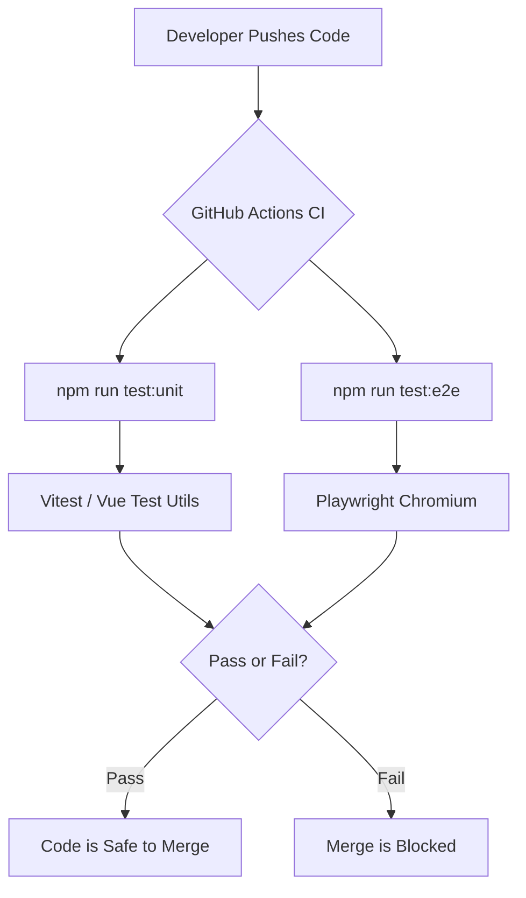

# Testing Guide / មគ្គុទ្ទេសក៍សាកល្បង

The Khmer Smart Calendar uses a multi-layered testing strategy to guarantee that business logic, UI components, and entire user journeys work flawlessly.  
ប្រតិទិនឆ្លាតវៃខ្មែរប្រើប្រាស់យុទ្ធសាស្រ្តសាកល្បងពហុកម្រិត ដើម្បីធានាថាតក្កវិជ្ជាអាជីវកម្ម សមាសភាគ UI និងដំណើរទាំងមូលរបស់អ្នកប្រើប្រាស់ដំណើរការដោយរលូនឥតខ្ចោះ។



## 1. Unit Testing / ការសាកល្បងឯកតា (Unit Testing)
We use **[Vitest](https://vitest.dev/)** for fast, headless unit testing. Unit tests are focused entirely on business logic and services without mounting Vue components.  
យើងប្រើប្រាស់ **[Vitest](https://vitest.dev/)** សម្រាប់ការសាកល្បងឯកតា (Unit testing) យ៉ាងរហ័សនិងដោយមិនប្រើកម្មវិធីរុករកផ្ទាល់។ ការសាកល្បងឯកតាផ្តោតទាំងស្រុងលើតក្កវិជ្ជាអាជីវកម្ម និងសេវាកម្មដោយមិនផ្ទុកសមាសភាគ Vue នោះទេ។

- **Location (ទីតាំង)**: `tests/services/`
- **What to test (អ្វីដែលត្រូវសាកល្បង)**: Data manipulation, array filtering, date conversions, and state management (e.g. `ThemeService`, `HolidayService`). (ការរៀបចំទិន្នន័យ ការត្រងអារេ ការបម្លែងកាលបរិច្ឆេទ និងការគ្រប់គ្រងទិន្នន័យ (State))

## 2. Component Testing / ការសាកល្បងសមាសភាគ (Component Testing)
Also powered by **Vitest** and **Vue Test Utils**. These tests mount isolated Vue components in a simulated browser environment (jsdom).  
ដំណើរការដោយ **Vitest** និង **Vue Test Utils** ផងដែរ។ ការសាកល្បងទាំងនេះដំណើរការសមាសភាគ Vue តែមួយឯកឯងនៅក្នុងបរិស្ថានកម្មវិធីរុករកក្លែងក្លាយ (jsdom)។

- **Location (ទីតាំង)**: `tests/components/` and `tests/views/`
- **What to test (អ្វីដែលត្រូវសាកល្បង)**: 
  - Ensure correct elements render based on specific props. (ធានាថាសមាសភាគត្រឹមត្រូវត្រូវបានបង្ហាញដោយផ្អែកលើ Props ជាក់លាក់)
  - Ensure components emit the correct events when buttons are clicked. (ធានាថាសមាសភាគបញ្ជូន Events ត្រឹមត្រូវនៅពេលប៊ូតុងត្រូវបានចុច)
  - Test edge-cases like missing data or empty states. (សាកល្បងស្ថានភាពពិសេសៗដូចជា ការបាត់បង់ទិន្នន័យ ឬស្ថានភាពទទេ)

**To run both Unit and Component Tests (ដើម្បីដំណើរការការសាកល្បងឯកតា និងសមាសភាគ):**
```bash
npm run test:unit
```

## 3. End-to-End (E2E) Testing / ការសាកល្បងពីចុងម្ខាងទៅចុងម្ខាង (E2E)
We use **[Playwright](https://playwright.dev/)** for E2E testing. Playwright spins up a real headless Chromium browser, boots up the local Vite development server, and clicks through the app exactly like a human user would.  
យើងប្រើប្រាស់ **[Playwright](https://playwright.dev/)** សម្រាប់ការសាកល្បង E2E។ Playwright បើកកម្មវិធីរុករក Chromium ក្លែងក្លាយពិតប្រាកដ បើកម៉ាស៊ីនបម្រើ Vite អភិវឌ្ឍន៍ និងចុចលើកម្មវិធីដូចគ្នាបេះបិទទៅនឹងអ្នកប្រើប្រាស់ជាមនុស្ស។

- **Location (ទីតាំង)**: `e2e/`
- **What to test (អ្វីដែលត្រូវសាកល្បង)**: 
  - Cross-page navigation. (ការរុករកឆ្លងកាត់ទំព័រផ្សេងៗ)
  - Complex UI interactions (e.g. Opening a BottomSheet, picking a theme color, and verifying the entire DOM changes visually). (អន្តរកម្ម UI ស្មុគស្មាញ (ឧ. ការបើកផ្ទាំងខាងក្រោម ការជ្រើសរើសពណ៌ស្បែក និងការផ្ទៀងផ្ទាត់ការផ្លាស់ប្តូរ DOM ទាំងមូលដោយផ្ទាល់ភ្នែក))
  
**To run E2E Tests (ដើម្បីដំណើរការការសាកល្បង E2E):**
```bash
npm run test:e2e
```
*(If this is your first time, you must run `npx playwright install` first so Playwright can download the actual Chrome/Firefox binaries to run the tests).*  
*(ប្រសិនបើនេះជាលើកទីមួយរបស់អ្នក អ្នកត្រូវដំណើរការ `npx playwright install` ជាមុនសិន ដើម្បីឲ្យ Playwright អាចទាញយកកម្មវិធីរុករក Chrome/Firefox ជាក់ស្តែងដើម្បីដំណើរការការសាកល្បងបាន)។*

## 4. Automation Tests (CI) / ការសាកល្បងស្វ័យប្រវត្តិ (CI)
Our tests don't just run locally! We have fully automated CI (Continuous Integration) pipelines via **GitHub Actions**.  
ការសាកល្បងរបស់យើងមិនត្រឹមតែដំណើរការនៅលើម៉ាស៊ីនរបស់អ្នកផ្ទាល់នោះទេ! យើងមានបំពង់ CI (Continuous Integration) ដែលដំណើរការដោយស្វ័យប្រវត្តិយ៉ាងពេញលេញតាមរយៈ **GitHub Actions**។

- **Workflow File (ឯកសារលំហូរការងារ)**: `.github/workflows/ci.yml`
- **Triggers (គន្លឹះដាស់)**: On every `push` and `pull_request`. (នៅលើរាល់ពេលធ្វើការ `push` និង `pull_request`)
- **Behavior (ឥរិយាបថ)**: A cloud Linux server automatically checks out your code, installs dependencies, and runs `npm run test:unit` and `npm run test:e2e`. (ម៉ាស៊ីន Linux នៅលើក្លោដ (Cloud) ទាញយកកូដរបស់អ្នកដោយស្វ័យប្រវត្តិ ដំឡើងកញ្ចប់ឯកសារ និងដំណើរការ `npm run test:unit` ព្រមទាំង `npm run test:e2e`)
- **Goal (គោលដៅ)**: To prevent broken code from ever being merged into the `main` branch. (ដើម្បីការពារកូដដែលខូចមិនឲ្យត្រូវបានបញ្ចូល (Merge) ទៅក្នុងមែកធាង `main`)
