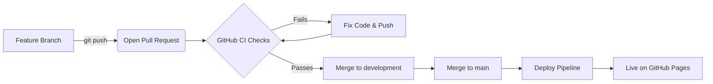

# Git Workflow & Deployment Guide / លំហូរការងារ Git & ការដាក់ពង្រាយ

This document outlines the standard operating procedure for collaborating, merging code, and deploying the Khmer Smart Calendar.  
ឯកសារនេះបង្ហាញពីនីតិវិធីប្រតិបត្តិការស្តង់ដារ សម្រាប់ការសហការ បញ្ចូលកូដ (Merge) និងការដាក់ពង្រាយ (Deploy) ប្រតិទិនឆ្លាតវៃខ្មែរ។



## 1. Branching Strategy / យុទ្ធសាស្រ្តបង្កើតមែកធាង (Branch)
We follow a standard Feature Branch workflow:  
យើងអនុវត្តតាមលំហូរការងារមែកធាងលក្ខណៈពិសេស (Feature Branch) ស្តង់ដារ៖
- **`main`**: The production-ready branch. Code here is always stable and directly reflects the live website. **Never commit directly to `main`.**  
  (មែកធាងសម្រាប់ចេញផលិតផលពិតប្រាកដ។ កូដនៅទីនេះតែងតែមានស្ថេរភាព និងឆ្លុះបញ្ចាំងដោយផ្ទាល់ពីគេហទំព័រដែលកំពុងផ្សាយផ្ទាល់។ **ហាមបញ្ជូនកូដ (Commit) ដោយផ្ទាល់ទៅកាន់ `main` ជាដាច់ខាត។**)
- **`development`**: The active integration branch. All features merge here first for collective testing.  
  (មែកធាងសមាហរណកម្មសកម្ម។ រាល់លក្ខណៈពិសេសទាំងអស់ត្រូវបានបញ្ចូលនៅទីនេះមុនគេ សម្រាប់ការសាកល្បងរួមគ្នា។)
- **Feature Branches**: Named `feature/<description>` or `fix/<description>` (e.g. `feature/dark-mode` or `fix/bottom-sheet-overflow`).  
  (មែកធាងលក្ខណៈពិសេស៖ ដាក់ឈ្មោះជា `feature/<ការពិពណ៌នា>` ឬ `fix/<ការពិពណ៌នា>` ឧ. `feature/dark-mode` ឬ `fix/bottom-sheet-overflow`។)

## 2. Git Push & Pull Requests (Merge Requests) / ការរុញ (Push) និងសំណើទាញយក (Pull Requests)
When you finish developing a feature:  
នៅពេលដែលអ្នកបញ្ចប់ការអភិវឌ្ឍន៍លក្ខណៈពិសេសណាមួយ៖

1. **Commit your code** using descriptive messages:  
   **បញ្ជូនកូដរបស់អ្នក (Commit)** ដោយប្រើសារពិពណ៌នាច្បាស់លាស់៖
   ```bash
   git add .
   git commit -m "feat: added new zodiac card UI"
   ```
2. **Push your branch** to GitHub:  
   **រុញ (Push) មែកធាងរបស់អ្នក** ទៅកាន់ GitHub៖
   ```bash
   git push origin feature/zodiac-ui
   ```
3. **Open a Pull Request (PR)** on GitHub targeting the `development` branch (or `main` if it's a hotfix).  
   **បើកសំណើទាញយក (Pull Request/PR)** នៅលើ GitHub ដោយកំណត់ទិសដៅទៅកាន់មែកធាង `development` (ឬ `main` ប្រសិនបើវាជាការជួសជុលបន្ទាន់ (hotfix))។

## 3. CI Automation (The Gatekeeper) / ស្វ័យប្រវត្តិកម្ម CI (អ្នកយាមទ្វារ)
When you open a Pull Request, our GitHub Actions CI pipeline (`.github/workflows/ci.yml`) automatically activates.  
នៅពេលអ្នកបើកសំណើទាញយក (Pull Request) បំពង់ CI របស់ GitHub Actions របស់យើង (`.github/workflows/ci.yml`) នឹងធ្វើសកម្មភាពដោយស្វ័យប្រវត្តិ។

The CI server will (ម៉ាស៊ីនបម្រើ CI នឹង)៖
1. Spin up an Ubuntu container. (បើក Ubuntu container មួយ)
2. Install all Node dependencies. (ដំឡើងកញ្ចប់ឯកសារ Node ទាំងអស់)
3. Run all **Unit & Component Tests** (`npm run test:unit`). (ដំណើរការ **ការសាកល្បងឯកតា និងសមាសភាគ** ទាំងអស់)
4. Run all **End-to-End Tests** (`npm run test:e2e`). (ដំណើរការ **ការសាកល្បងពីចុងម្ខាងទៅចុងម្ខាង (E2E)** ទាំងអស់)
5. Attempt a production build (`npm run build`). (ព្យាយាមបង្កើតសម្រាប់ចេញផលិតផល (Build))

**Rule (ច្បាប់)៖** You **cannot** merge your Pull Request until the CI pipeline passes (shows a green checkmark). If it fails, check the GitHub Action logs, fix your code locally, and push again.  
អ្នក **មិនអាច** បញ្ចូលសំណើទាញយក (Merge PR) របស់អ្នកបានទេ រហូតទាល់តែបំពង់ CI បានឆ្លងកាត់ដោយជោគជ័យ (បង្ហាញសញ្ញាគ្រីសពណ៌បៃតង)។ ប្រសិនបើវាបរាជ័យ សូមពិនិត្យមើលកំណត់ត្រា (Logs) របស់ GitHub Action ជួសជុលកូដរបស់អ្នក ហើយរុញ (Push) វាម្តងទៀត។

## 4. Deployment (CD Automation) / ការដាក់ពង្រាយ (ស្វ័យប្រវត្តិកម្ម CD)
We use Continuous Deployment (CD) powered by GitHub Pages and Actions.  
យើងប្រើប្រាស់ការដាក់ពង្រាយជាបន្តបន្ទាប់ (CD) ដែលដំណើរការដោយ GitHub Pages និង Actions។

- **Workflow File (ឯកសារលំហូរការងារ)**: `.github/workflows/deploy.yml`
- **Trigger (គន្លឹះដាស់)**: Only triggers when code is merged or pushed into the **`main`** branch. (ធ្វើសកម្មភាពលុះត្រាតែកូដត្រូវបានបញ្ចូល ឬរុញចូលទៅក្នុងមែកធាង **`main`** ប៉ុណ្ណោះ)

When a Pull Request is approved and merged into `main`, the `deploy.yml` pipeline takes over. It verifies the unit tests one final time, builds the production `dist/` folder, and automatically pushes those files to GitHub Pages.  
នៅពេលដែលសំណើទាញយកត្រូវបានអនុម័ត និងបញ្ចូលទៅក្នុង `main` បំពង់ `deploy.yml` នឹងចាប់ផ្តើម។ វាផ្ទៀងផ្ទាត់ការសាកល្បងឯកតាម្តងទៀត បង្កើតថត `dist/` សម្រាប់ផលិតផល និងរុញឯកសារទាំងនោះទៅកាន់ GitHub Pages ដោយស្វ័យប្រវត្តិ។

Your updates will be live globally at `https://<username>.github.io/vue-base-project/` within minutes!  
ការអាប់ដេតរបស់អ្នកនឹងមានផ្សាយបន្តផ្ទាល់ជាសកលនៅលើ `https://<username>.github.io/vue-base-project/` ក្នុងរយៈពេលប៉ុន្មាននាទី!
